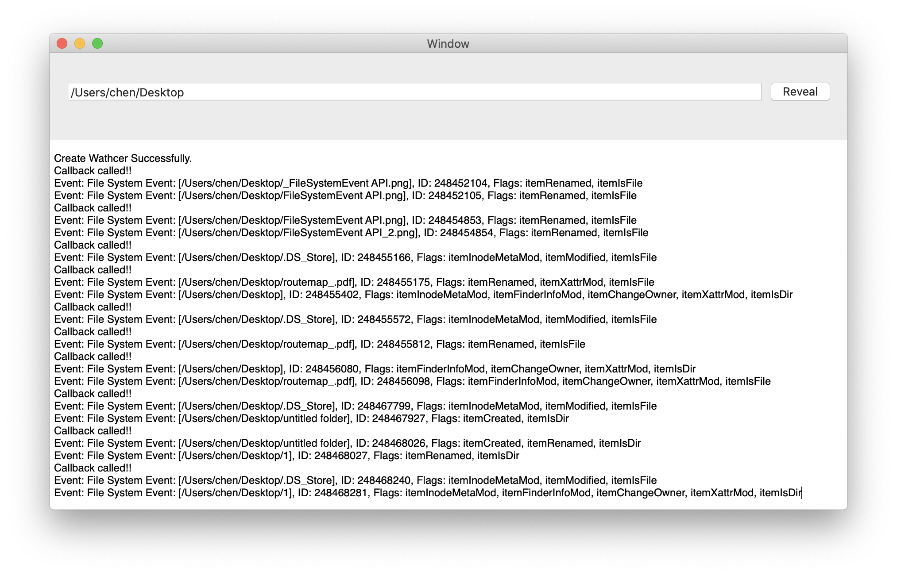
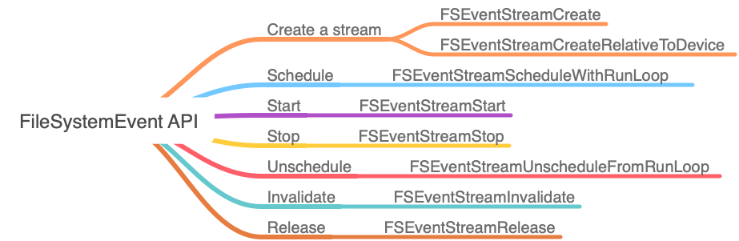

# Waaatcher

[](https://travis-ci.com/hechen/Waaatcher)

File Watcher Wrapper for macOS


### Demo



### FileSystemEvent




### How to use

#### Start

``` Swift
let watcher = Waaatcher(paths: [path1, path2, path3])

// ...
watcher.watcherEventCallback = { events in
    print("Events: \(events)")
}

watcher.start()
```

#### Stop

``` Swift
watcher.stop()
// or watcher = nil
```


Each event is a structure which contains three parts as below

``` Swift
struct WaaaFSEvent {
    let path: String
    let flags: WaaaFSEventFlags
    let ID: FSEventStreamEventId
}
```

Also, `WaaaFSEventFlags` is defined as the wrapper of unreadable `FSEventStreamEventFlags`.


### References

1. [Using the FSEventsFramework](https://developer.apple.com/library/archive/documentation/Darwin/Conceptual/FSEvents_ProgGuide/UsingtheFSEventsFramework/UsingtheFSEventsFramework.html)
2. [Apple FSEvents](http://nicoleibrahim.com/apple-fsevents-forensics/)
